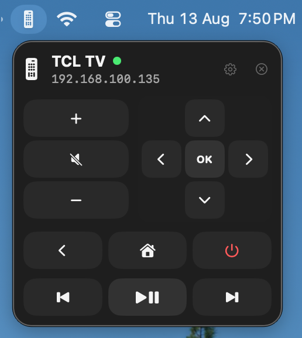

# macOS TV Remote

A native menu bar remote for Android TV and Google TV.

<p align="center">
  
</p>

## Features

- Direction, volume, playback, Home, Back, and Power controls
- Pairing from the menu bar
- Configurable TV address and button sound
- Direct local connection with no cloud service

## Install

Requires macOS 14 or later, Xcode, and a TV on the same network.

```bash
git clone https://github.com/EduardoCusihuaman/macos-tv-remote.git
cd macos-tv-remote
./install.sh
```

The script creates a local pairing identity, builds the Release app, installs it
in `~/Applications`, and opens it.

If Xcode is not selected:

```bash
sudo xcode-select -s /Applications/Xcode.app
```

If macOS blocks the first launch, allow it from **System Settings > Privacy &
Security > Open Anyway**.

## Pair

1. Open the remote from the menu bar.
2. Select the gear and enter the TV's IPv4 address.
3. Select the link button.
4. Enter the six-character code shown on the TV.

On first use, Keychain may request access to **Imported Private Key**; enter your Mac password and select **Always Allow**.

## Update

```bash
git pull --ff-only
./install.sh
```

## Uninstall

```bash
./uninstall.sh
```

Use `./uninstall.sh --purge` to also delete the local pairing identity.

## Development

The project is generated from `project.yml` with
[XcodeGen](https://github.com/yonaskolb/XcodeGen):

```bash
brew install xcodegen
xcodegen generate
```

The app uses SwiftUI and the vendored
[`AndroidTVRemoteControl`](https://github.com/odyshewroman/AndroidTVRemoteControl)
package. Remote traffic uses TCP `6466`; pairing uses TCP `6467`.

Certificates and build artifacts are generated locally and ignored by Git.
